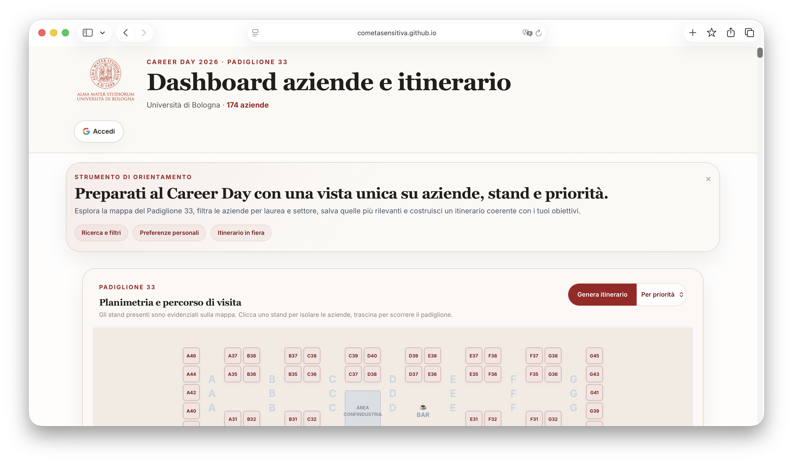
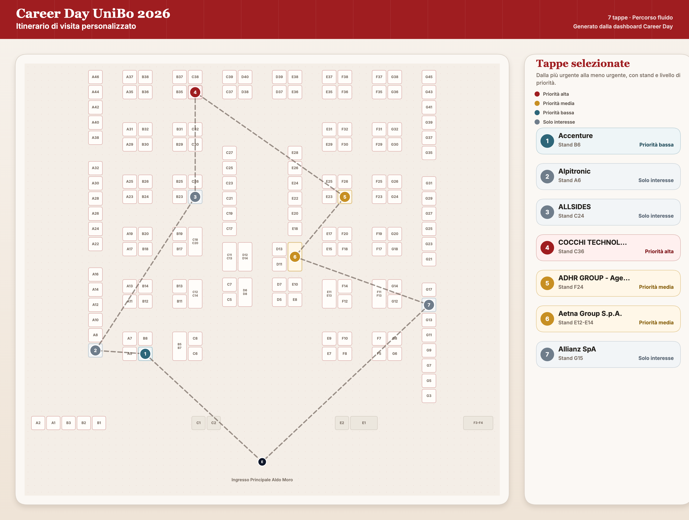
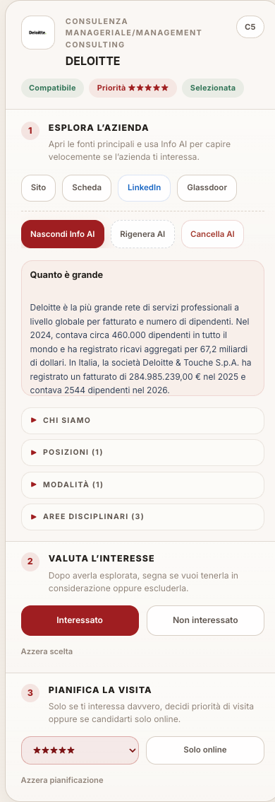

# Career Day UniBo 2026

Dashboard web per orientarsi tra le aziende del Career Day UniBo: filtri, mappa stand, preferenze personali, itinerario e supporto AI.

## Screenshot

### Dashboard overview



### Itinerario e mappa



### Scheda azienda



## Cosa fa

- Ricerca e filtri per settore, corso di laurea, compatibilita e preferenze.
- Mappa stand interattiva con itinerario di visita ed export PNG.
- Preferenze utente sincronizzate su Firebase solo nel nodo personale.
- Export delle aziende selezionate.
- Overview AI per azienda con API key Gemini salvata solo nel browser utente.

## Stack

- Frontend statico: `index.html` + ES modules vanilla JS
- Styling: CSS custom + Tailwind generato localmente
- Persistenza: Firebase Realtime Database + Google Auth
- Tooling dati: script Python per scraping, arricchimento e validazione

## Avvio locale

```bash
npm install
npm run build:tailwind
python3 -m http.server 8000
```

Apri:

- `http://127.0.0.1:8000/index.html`

## Check locali

```bash
npm run build:tailwind
npm run check:js
npm run check:py
npm run validate:data
```

## Aggiornare il dataset

Workflow consigliato:

1. recupera i nuovi dati dal sito sorgente
2. aggiorna `aziende_dettagli.json`
3. aggiorna la mappa stand se serve
4. esegui i check locali
5. verifica la dashboard in browser

Documentazione operativa:

- [Dashboard Update Workflow](docs/DASHBOARD_UPDATE_WORKFLOW.md)

## Struttura repository

```text
.
├── index.html
├── app.js
├── styles.css
├── js/
│   ├── dashboard/
│   └── shared/
├── tools/
├── logos/
├── docs/
├── database.rules.json
└── aziende_dettagli.json
```

## Automazioni GitHub

Il repository include:

- GitHub Actions CI per build e check principali
- template per bug report, feature request e aggiornamenti dati
- pull request template con checklist minima
- Dependabot per dipendenze npm e GitHub Actions

## Sicurezza

- La Gemini key non e nel repository e non viene scritta su Firebase.
- Il client non legge piu dati globali di altri utenti.
- Le regole Firebase sono versionate in `database.rules.json`.

## Limiti noti

- Alcune aziende possono non avere ancora stand confermato.
- Il dataset puo contenere siti `http://` o email mancanti finche non vengono corretti alla fonte o manualmente.
- Il cache busting dei moduli frontend e ancora gestito manualmente via querystring.

## Licenza

Il codice del progetto e rilasciato sotto licenza MIT.  
Loghi, marchi, dati aziendali e materiali di terze parti possono restare soggetti ai rispettivi diritti e non sono automaticamente riutilizzabili fuori dal contesto del progetto.
