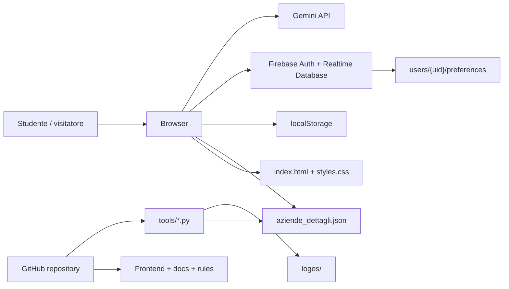
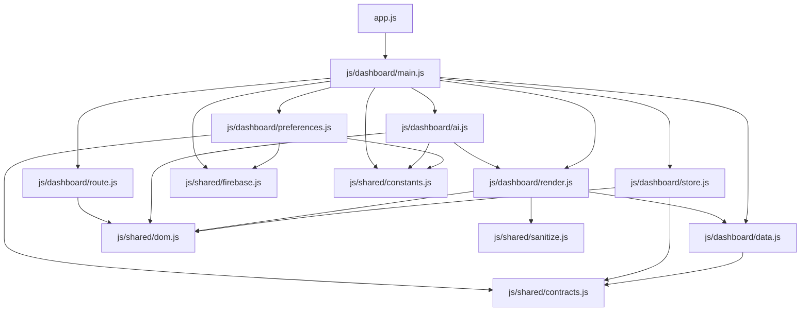
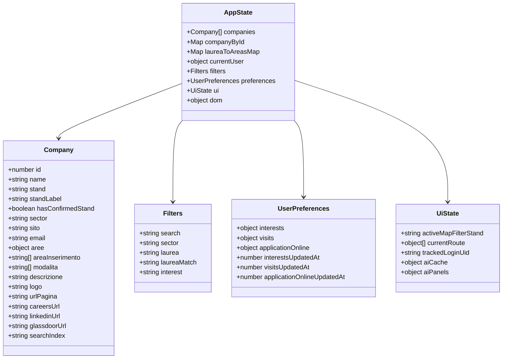
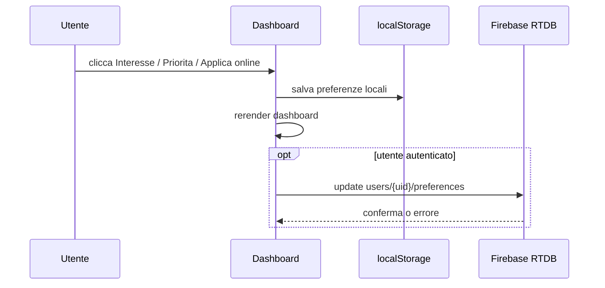
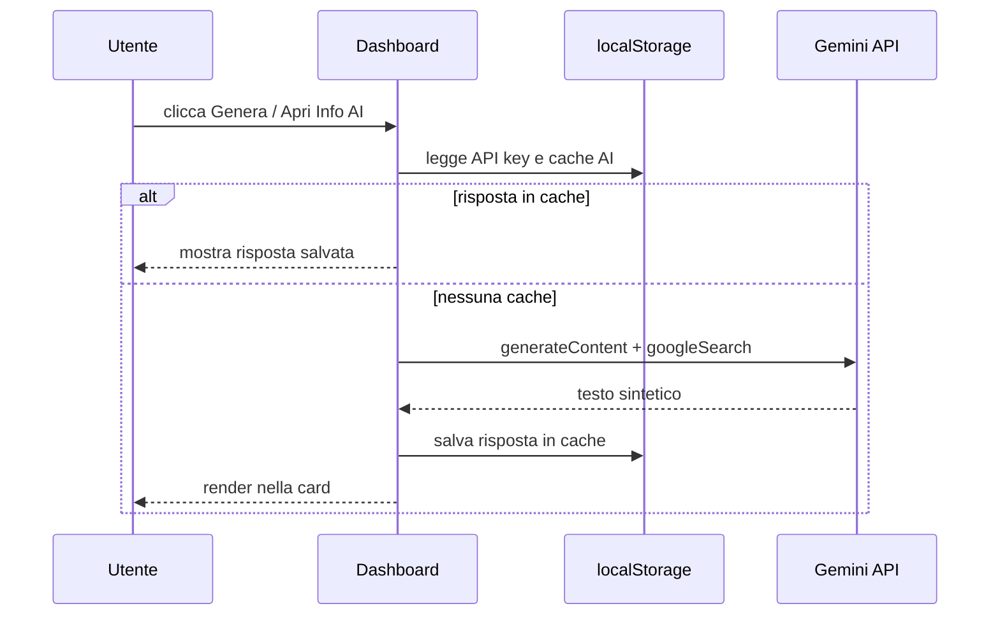
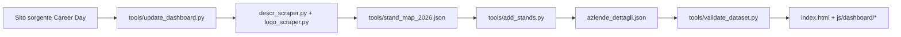

# Architecture Overview

Questo progetto non usa classi applicative in senso OO tradizionale.  
La struttura e principalmente **modulare**: ES modules lato browser, stato centralizzato in uno store runtime e utility condivise.

## Come leggere questo file

Ordine consigliato:

1. attori e infrastruttura
2. mappa moduli frontend
3. contratti runtime
4. flussi applicativi
5. responsabilita file

## Attori e infrastruttura

## Mappa moduli frontend

## Contratti runtime principali

## Flusso preferenze

## Flusso Info AI

## Flusso dati e aggiornamento dataset

## Responsabilita file principali

| File | Responsabilita |
| --- | --- |
| `app.js` | bootstrap minimo del frontend |
| `index.html` | shell HTML della dashboard |
| `styles.css` | visual design e component styling |
| `js/dashboard/main.js` | orchestrazione eventi, boot, auth state, render cycle |
| `js/dashboard/render.js` | griglia aziende, filtri, mappa statica, dropdown custom |
| `js/dashboard/preferences.js` | preferenze locali + sync Firebase |
| `js/dashboard/ai.js` | cache AI, key management, richiesta Gemini |
| `js/dashboard/route.js` | itinerario, mappa route, export PNG |
| `js/dashboard/data.js` | caricamento e normalizzazione dataset |
| `js/dashboard/store.js` | store applicativo e DOM refs |
| `js/shared/contracts.js` | shape runtime e normalizzazione dati |
| `js/shared/firebase.js` | inizializzazione Firebase condivisa |
| `js/shared/sanitize.js` | sanitizzazione HTML/markdown/link |
| `tools/*.py` | scraping, arricchimento e validazione dataset |

## Note architetturali

- L'app e **frontend-first**: niente backend custom, niente Cloud Functions.
- La persistenza remota e limitata alle preferenze utente.
- L'AI e opzionale e dipende da una chiave locale del browser.
- Il progetto e pensato per essere mantenibile anche senza framework.
